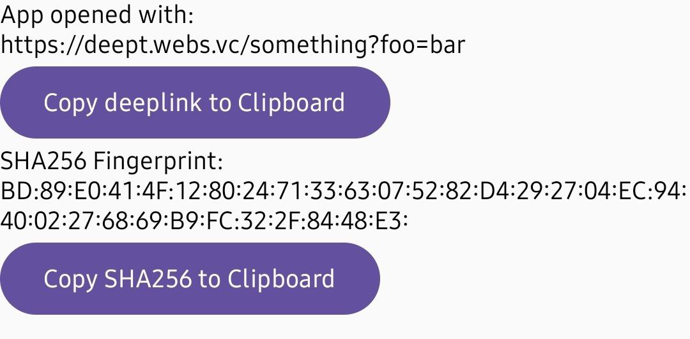

# deept

Android deeplink testing tool

## Why?

This tool shows unprocessed deeplink that have opened the app same way that app sees it.

## Usage

Download and install [`deept.apk`](https://github.com/vearutop/deept/releases/download/v0.1.0/deept.apk) from [releases](https://github.com/vearutop/deept/releases).



[Page with sample links](https://tools.webs.vc/mock?body=GwADoGRqXv8Sp%2FhsI%2FKuQ5q6Ccw%2FR8OiNnW%2BNkEcSRygZXNacHVzarC8h5slKelCQ7FFGPCkhC8v8b7hPf0Y3EIdxtLqaiFxCCfwRiOcniow5KW7Hjsd1CcM6MdTRqheFiPPdi3Pfmm7rpfTGfiax0an3EfrXulgfwJUxCbn9YYS2Rm9OyM%2BYmgFbkqTbRQMNVqxTLACNKQ4htm1SapSLR%2Bz1RaZSyjLs30Dib9MMAJj%2Fppc%2B6i157keIrNE6hORCYEEHiqlmktvsZ1L%2BjfDd8O%2BjT5kwhw%2BVX7Au0B4nBj1smh5tjsfXvMvQoUFtYzBFVI2LFm3ytiqDQ%3D%3D&ct=text%2Fhtml)

[deept direct](deept://foo?bar=baz&quux)
```
deept://foo?bar=baz&quux
```

[deept intent](intent://foo?bar=baz&quux#Intent;scheme=deept;package=com.example.deept;S.market_referrer=blabla%3D123bar;S.browser_fallback_url=https%3A%2F%2Fexample.com%2F;end)
```
intent://foo?bar=baz&quux#Intent;scheme=deept;package=com.example.deept;S.market_referrer=blabla%3D123bar;S.browser_fallback_url=https%3A%2F%2Fexample.com%2F;end
```

[deept unversal link](https://deept.webs.vc/something?foo=bar)
```
https://deept.webs.vc/something?foo=bar
```

